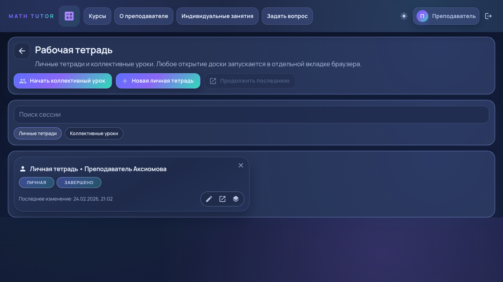
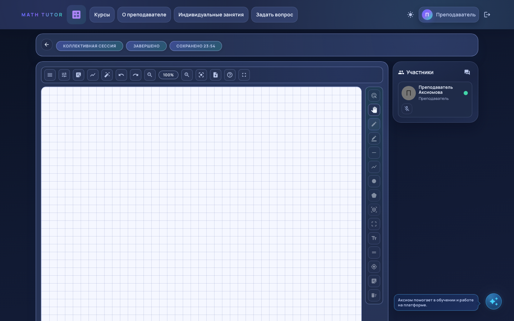

# Math Realtime Lesson Demo

Демо-витрина сценария коллективного урока: учитель, участники, приглашения, синхронная работа на доске.

## Скриншоты



## Что показано
- Старт/завершение коллективной сессии.
- Ролевая модель teacher/student.
- Приглашение участников в урок.
- Синхронизация состояния в процессе урока.
- Управление доступом участника к инструментам.

## Стек
- React + TypeScript + Vite
- MUI
- mock API/server + realtime события

## Быстрый старт
```bash
npm install
npm run dev:showcase
```

Откроется маршрут: `/workbook` (если браузер не открылся автоматически: [http://localhost:5173/workbook](http://localhost:5173/workbook)).

## Демо-доступ
- Учитель: `teacher@axiom.demo` / `magic`
- Студент: `student@axiom.demo` / `magic`

## Что оценивать на собеседовании
- Реализация ролей и прав.
- Алгоритм realtime-синхронизации.
- Устойчивость сессии до/после завершения урока.
- UX для преподавателя при управлении участниками.

## Ограничения
- Видео отключено, акцент на доске и совместной работе.
- Используется mock backend.
